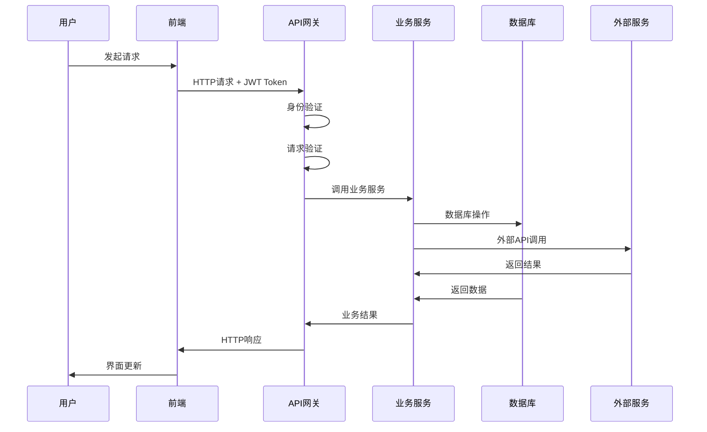
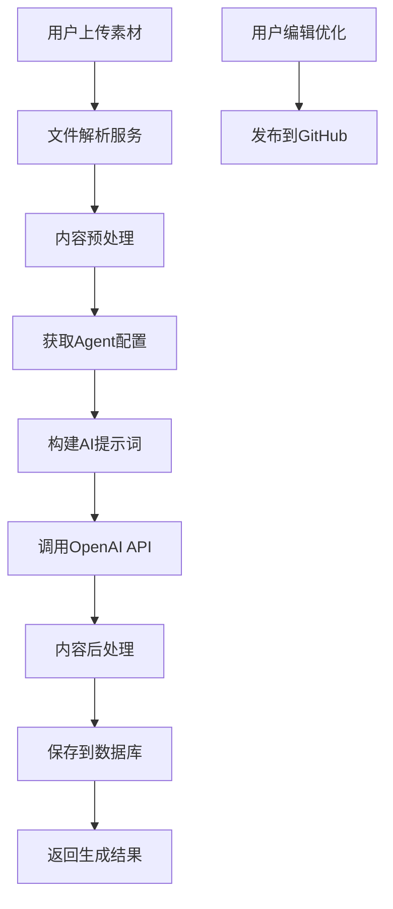
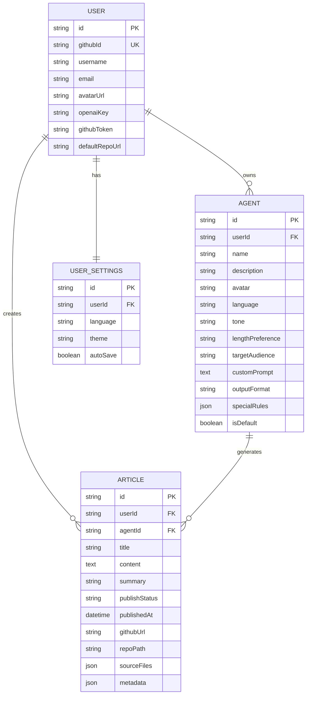
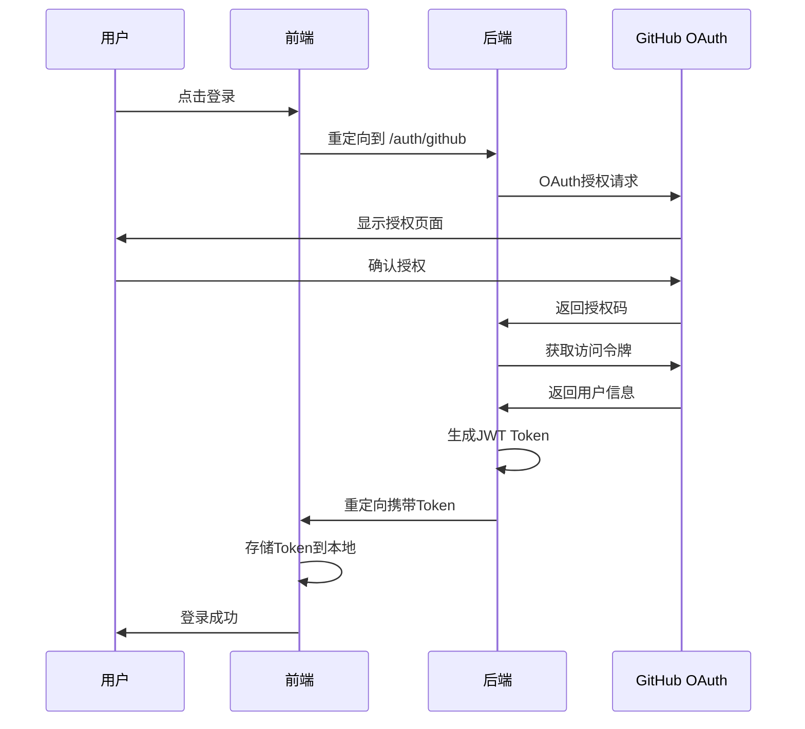
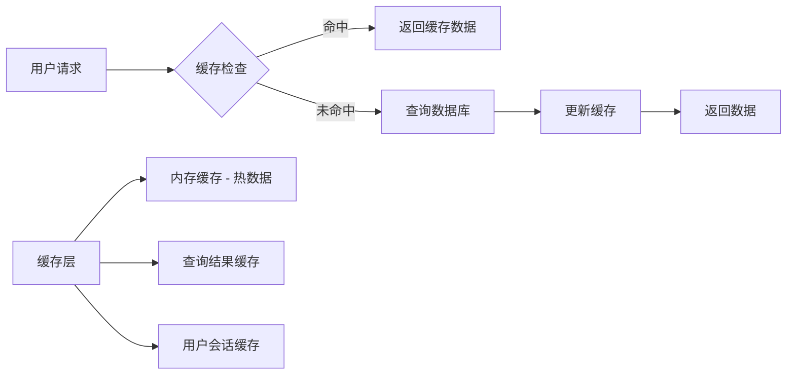
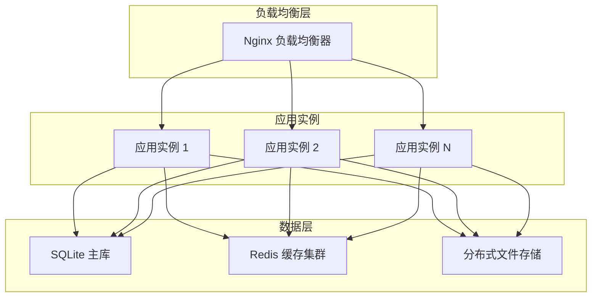
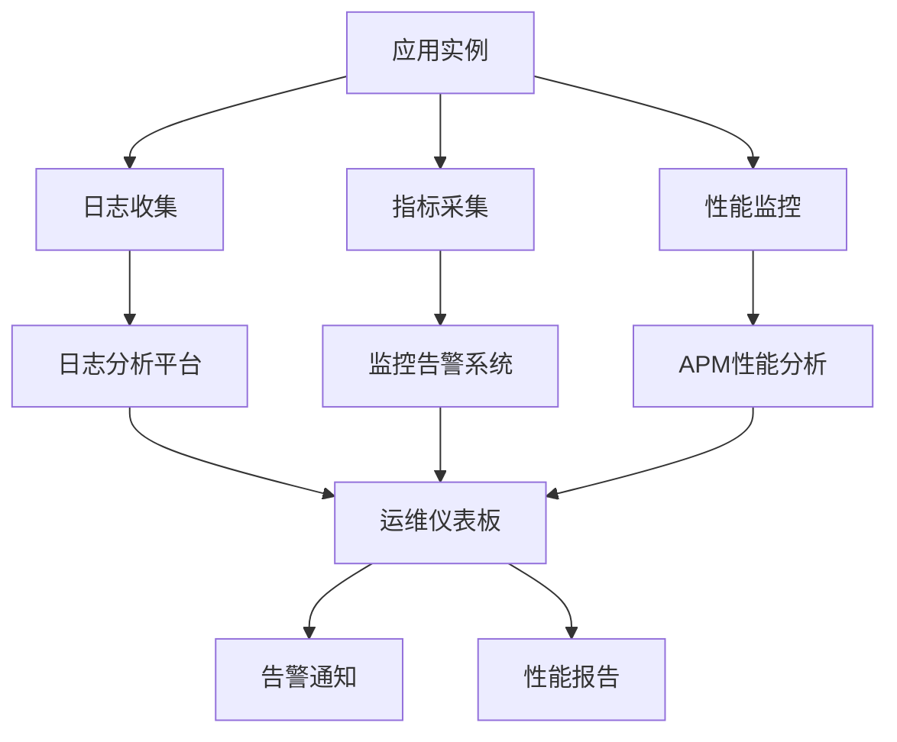
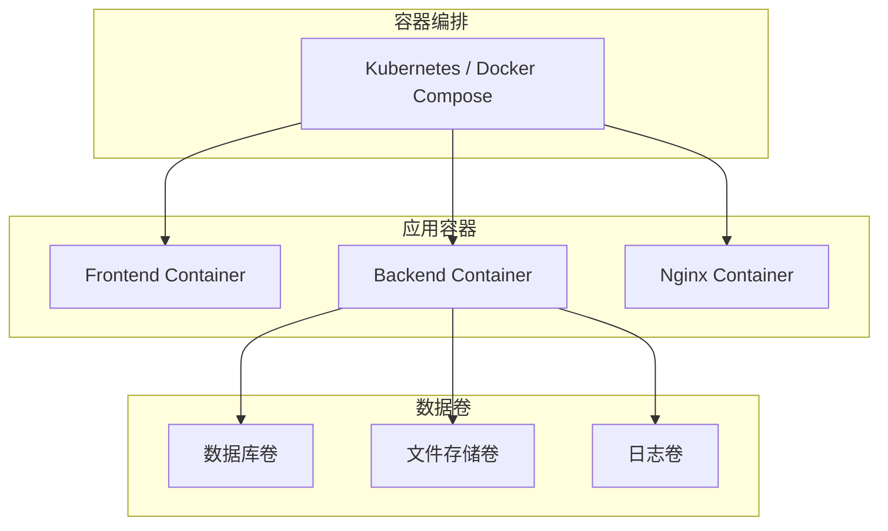

# 系统架构设计

## 🏗️ 整体架构

Muses采用现代化的前后端分离架构，结合微服务思想和模块化设计，确保系统的可扩展性、可维护性和高性能。

## 📊 架构层次

### 1. 用户界面层 (Frontend Layer)
- **技术栈**: Next.js 14 + TypeScript + Tailwind CSS
- **端口**: 3000
- **职责**: 
  - 用户交互界面
  - 状态管理和数据缓存
  - 路由管理和页面渲染
  - 响应式设计和用户体验

### 2. API网关层 (Gateway Layer)
- **技术栈**: Express.js + TypeScript
- **端口**: 8080
- **职责**:
  - 请求路由和转发
  - 身份认证和授权
  - 请求验证和参数校验
  - 错误处理和日志记录
  - 限流和安全防护

### 3. 业务逻辑层 (Service Layer)
- **模块化服务**:
  - **用户管理服务**: 用户注册、登录、设置管理
  - **Agent管理服务**: AI助手的创建、配置、管理
  - **文章生成服务**: 素材处理、AI调用、内容生成
  - **文件处理服务**: 文件上传、解析、存储管理
  - **发布管理服务**: GitHub集成、文章发布、版本控制

### 4. 数据存储层 (Storage Layer)
- **主数据库**: SQLite + Prisma ORM
- **文件存储**: 本地文件系统
- **缓存层**: 内存缓存 (node-cache)

### 5. 外部服务层 (External Services)
- **AI服务**: OpenAI GPT-4 API
- **认证服务**: GitHub OAuth
- **发布服务**: GitHub Repository API

## 🔄 数据流设计

### 典型请求流程

### 文章生成流程

## 🗄️ 数据架构

### 核心实体关系

## 🔐 安全架构

### 认证授权流程

### 数据安全措施

1. **加密存储**: OpenAI API Key 和 GitHub Token 使用 AES-256-GCM 加密
2. **JWT认证**: 无状态的用户身份验证
3. **权限隔离**: 用户只能访问自己的数据
4. **请求验证**: 使用 Zod 进行严格的输入验证
5. **限流保护**: 防止恶意请求和API滥用

## 🚀 性能架构

### 缓存策略

### 性能优化点

1. **前端优化**:
   - React组件懒加载
   - TanStack Query 智能缓存
   - Next.js 静态生成和增量渲染
   - 图片和资源优化

2. **后端优化**:
   - 数据库查询优化
   - 内存缓存热点数据
   - 异步处理重任务
   - 连接池管理

3. **网络优化**:
   - Gzip压缩
   - 静态资源CDN
   - HTTP/2支持
   - 智能预加载

## 🔄 扩展架构

### 水平扩展方案

### 微服务演进

未来可以将单体应用拆分为微服务：

1. **用户服务** - 用户管理和认证
2. **Agent服务** - AI助手配置管理
3. **生成服务** - 文章生成和AI调用
4. **文件服务** - 文件上传和处理
5. **发布服务** - GitHub集成和发布
6. **网关服务** - API路由和认证

## 📊 监控架构

### 系统监控体系

### 关键指标监控

1. **业务指标**:
   - 用户注册和活跃度
   - 文章生成成功率
   - API调用频率和成功率

2. **技术指标**:
   - 响应时间和吞吐量
   - 错误率和可用性
   - 资源使用率（CPU、内存、磁盘）

3. **外部依赖**:
   - OpenAI API 响应时间
   - GitHub API 可用性
   - 数据库连接状态

## 🔧 部署架构

### 容器化部署

### 多环境部署

1. **开发环境**: 本地开发，热重载
2. **测试环境**: 功能测试，集成测试
3. **预生产环境**: 性能测试，压力测试
4. **生产环境**: 高可用部署，监控告警

## 📈 未来架构规划

### 短期目标 (3-6个月)
- [ ] 引入Redis缓存
- [ ] 实现更细粒度的权限控制
- [ ] 添加实时通知系统
- [ ] 优化数据库查询性能

### 中期目标 (6-12个月)
- [ ] 微服务架构重构
- [ ] 消息队列异步处理
- [ ] 分布式文件存储
- [ ] 多地域部署

### 长期目标 (1-2年)
- [ ] 多租户SaaS架构
- [ ] 实时协作编辑
- [ ] AI模型本地化部署
- [ ] 边缘计算优化 