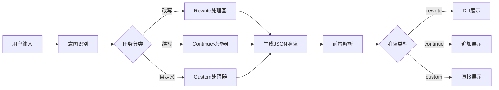

# 大模型JSON格式化响应 - 技术方案与提示词

## 📋 需求概述

构建一个系统，让大模型以结构化的JSON格式返回响应，支持不同类型的文本处理任务，并在前端实现智能的差异对比展示。

## 🎯 核心目标

1. **统一响应格式**：所有大模型响应都以JSON格式返回
2. **任务类型识别**：自动识别用户意图并分类任务
3. **差异可视化**：对于改写任务，前端展示具体的修改内容
4. **灵活扩展**：支持未来新增任务类型

## 📐 技术方案

### 1. JSON响应结构设计

```typescript
interface LLMResponse {
  type: 'rewrite' | 'continue' | 'custom';
  result: string;
  metadata?: {
    original?: string;          // 原文（仅rewrite类型）
    changes?: ChangeDetail[];   // 修改详情（仅rewrite类型）
    context?: string;           // 上下文信息
    confidence?: number;        // 任务类型判断置信度
    suggestions?: string[];     // 额外建议
  };
  debug?: {
    reasoning?: string;         // 任务类型判断理由
    alternatives?: string[];    // 其他可能的处理方式
  };
}

interface ChangeDetail {
  type: 'add' | 'delete' | 'modify';
  original: string;
  modified: string;
  position: {
    start: number;
    end: number;
  };
  reason?: string;  // 修改原因
}
```

### 2. 任务类型定义

| 任务类型 | 标识符 | 触发条件 | 返回内容 |
|---------|--------|----------|----------|
| **改写** | `rewrite` | 用户明确要求"修改"、"改写"、"优化"、"润色"等 | 修改后的完整文本 + 原文 + 修改详情 |
| **续写** | `continue` | 用户要求"继续写"、"补充"、"扩展"、"基于...写" | 新增的内容 + 续写的起始位置 |
| **自定义** | `custom` | 其他明确指令，如"生成"、"创建"、"分析"等 | 根据指令生成的内容 |

### 3. 前端Diff展示方案

```javascript
// 使用diff库进行文本对比
import { diffWords, diffLines } from 'diff';

function visualizeDiff(original, modified) {
  const diffs = diffWords(original, modified);
  
  return diffs.map(part => ({
    type: part.added ? 'add' : part.removed ? 'delete' : 'unchanged',
    value: part.value,
    count: part.count
  }));
}

// 渲染差异的React组件示例
function DiffViewer({ original, modified }) {
  const diffs = visualizeDiff(original, modified);
  
  return (
    <div className="diff-viewer">
      {diffs.map((part, index) => (
        <span
          key={index}
          className={`diff-${part.type}`}
          title={part.type === 'delete' ? '删除' : part.type === 'add' ? '新增' : ''}
        >
          {part.value}
        </span>
      ))}
    </div>
  );
}
```

### 4. 系统架构



## 🤖 给Claude Code的提示词

```markdown
# 任务：实现大模型JSON格式化响应系统

## 项目目标
创建一个完整的系统，让大模型以结构化JSON格式返回响应，并在前端实现智能的差异对比展示。

## 技术栈要求
- 后端：Node.js/Express 或 Python/FastAPI
- 前端：React + TypeScript
- 差异对比库：diff 或 jsdiff
- 样式：Tailwind CSS 或 styled-components

## 核心功能实现

### 1. 后端API设计
创建一个统一的API端点，处理所有类型的文本任务：

```typescript
POST /api/process-text
{
  "input": string,      // 用户输入
  "context"?: string,   // 可选的上下文
  "options"?: {
    "model": string,
    "temperature": number
  }
}
```

### 2. 大模型Prompt模板
为每种任务类型设计专门的prompt模板：

```python
PROMPTS = {
    "rewrite": """
    任务：改写以下文本
    原文：{original_text}
    要求：{requirements}
    
    请返回JSON格式：
    {
      "type": "rewrite",
      "result": "改写后的完整文本",
      "metadata": {
        "original": "原始文本",
        "changes": [具体修改记录]
      }
    }
    """,
    
    "continue": """
    任务：续写文本
    已有内容：{existing_text}
    要求：{requirements}
    
    请返回JSON格式：
    {
      "type": "continue",
      "result": "续写的内容"
    }
    """,
    
    "custom": """
    任务：{custom_instruction}
    
    请返回JSON格式：
    {
      "type": "custom",
      "result": "生成的内容"
    }
    """
}
```

### 3. 意图识别模块
实现一个智能的意图识别器：

```python
def classify_intent(user_input: str) -> str:
    rewrite_keywords = ["修改", "改写", "优化", "润色", "改进", "调整"]
    continue_keywords = ["继续", "续写", "补充", "扩展", "接着写"]
    
    # 使用关键词匹配或更高级的NLP方法
    for keyword in rewrite_keywords:
        if keyword in user_input:
            return "rewrite"
    
    for keyword in continue_keywords:
        if keyword in user_input:
            return "continue"
    
    return "custom"
```

### 4. 前端组件实现

#### 主要组件结构：
```
src/
├── components/
│   ├── TextProcessor/
│   │   ├── index.tsx          # 主组件
│   │   ├── InputArea.tsx      # 输入区域
│   │   ├── ResultDisplay.tsx  # 结果展示
│   │   └── DiffViewer.tsx     # 差异展示
│   └── common/
│       ├── JsonViewer.tsx     # JSON查看器
│       └── LoadingSpinner.tsx
├── hooks/
│   ├── useTextProcess.ts      # 处理逻辑Hook
│   └── useDiff.ts            # 差异对比Hook
├── services/
│   └── api.ts                # API调用
└── types/
    └── index.ts              # TypeScript类型定义
```

#### DiffViewer组件要求：
1. 支持字符级、单词级、行级对比
2. 高亮显示新增（绿色）、删除（红色）、修改（黄色）
3. 支持并排对比和行内对比两种模式
4. 提供统计信息（修改字数、修改比例等）

### 5. 样式设计
```css
/* 差异展示样式 */
.diff-viewer {
  font-family: 'Monaco', 'Consolas', monospace;
  line-height: 1.6;
}

.diff-add {
  background-color: #d4f4dd;
  color: #18981a;
  text-decoration: none;
}

.diff-delete {
  background-color: #ffd4d4;
  color: #d00;
  text-decoration: line-through;
}

.diff-modify {
  background-color: #fff3cd;
  color: #856404;
}

/* 添加过渡动画 */
.diff-add, .diff-delete, .diff-modify {
  transition: all 0.3s ease;
}
```

### 6. 错误处理与边界情况
1. JSON解析失败的降级处理
2. 大模型返回格式不符的容错
3. 超长文本的性能优化
4. 网络请求失败的重试机制

### 7. 测试用例
提供完整的测试套件：
- 单元测试：意图识别、差异计算
- 集成测试：API端点测试
- E2E测试：完整用户流程

### 8. 部署配置
- Docker配置文件
- 环境变量管理
- CI/CD pipeline

## 交付要求
1. 完整的项目代码，包含前后端
2. 详细的README文档
3. API文档（使用Swagger或类似工具）
4. 部署指南
5. 示例演示（包含各种任务类型）

## 额外优化建议
1. 实现响应流式传输，提升用户体验
2. 添加历史记录功能
3. 支持批量处理
4. 提供API密钥管理
5. 实现使用统计和分析

请基于以上需求，创建一个生产级别的完整解决方案。重点关注代码质量、用户体验和系统可扩展性。
```

## 🎨 UI/UX设计建议

### 界面布局
```
┌─────────────────────────────────────┐
│          文本处理助手              │
├─────────────────────────────────────┤
│ ┌─────────────┐ ┌─────────────┐   │
│ │   输入区域   │ │   结果展示   │   │
│ │             │ │             │   │
│ │             │ │  [改写模式]  │   │
│ │             │ │  显示差异    │   │
│ │             │ │             │   │
│ └─────────────┘ └─────────────┘   │
│                                     │
│ [处理类型: 改写] [查看JSON] [导出] │
└─────────────────────────────────────┘
```

### 交互细节
1. **实时预览**：输入时显示任务类型识别结果
2. **快捷操作**：支持快捷键切换视图模式
3. **历史对比**：保存多个版本，支持版本间对比
4. **导出功能**：支持导出原文、修改后文本、差异报告

## 📊 性能优化建议

1. **差异计算优化**
   - 对长文本使用分块处理
   - 实现虚拟滚动，避免渲染性能问题
   - 使用Web Worker进行差异计算

2. **缓存策略**
   - 缓存相同输入的处理结果
   - 使用IndexedDB存储历史记录
   - 实现智能预加载

3. **响应优化**
   - 使用Server-Sent Events实现流式响应
   - 分步骤展示处理进度
   - 优先展示部分结果

## 🚀 扩展功能路线图

1. **多语言支持**：识别并处理不同语言的文本
2. **协作功能**：支持多人协同编辑和审核
3. **模板系统**：预设常用的改写模板
4. **AI建议**：基于上下文提供智能建议
5. **插件系统**：支持自定义处理器和展示组件