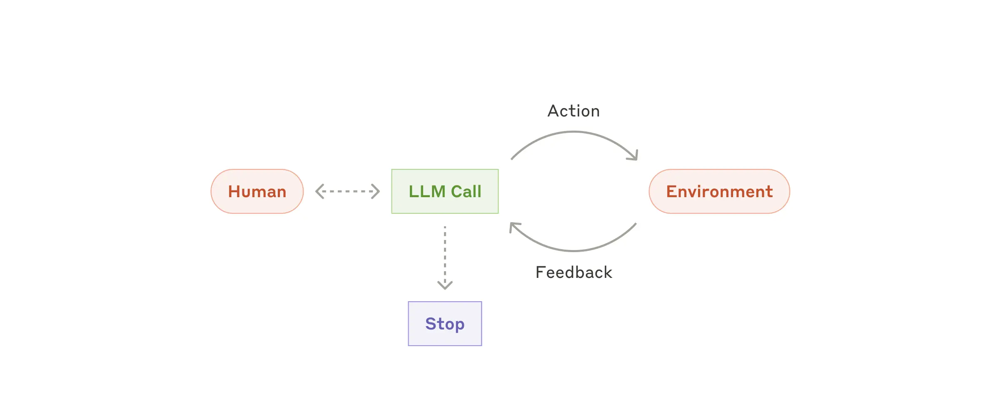
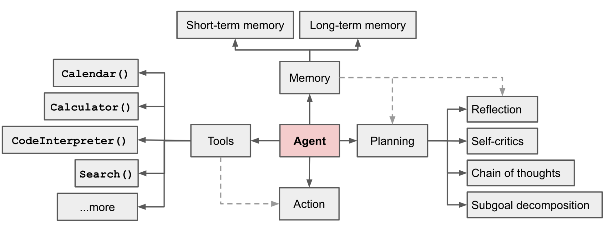
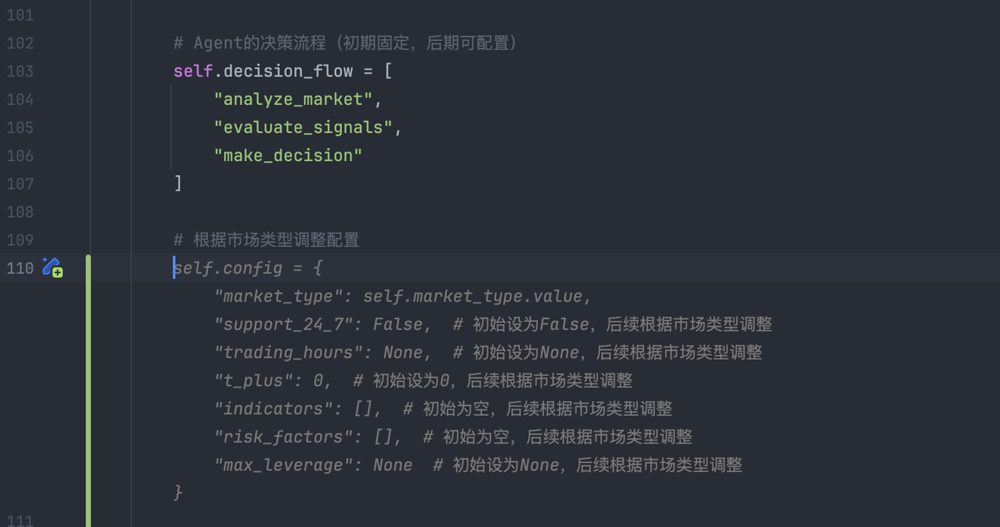
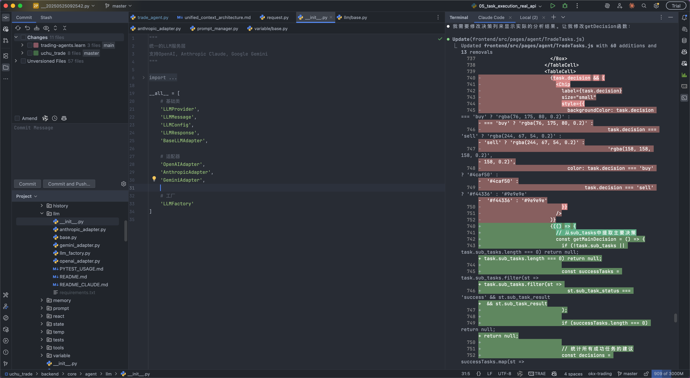
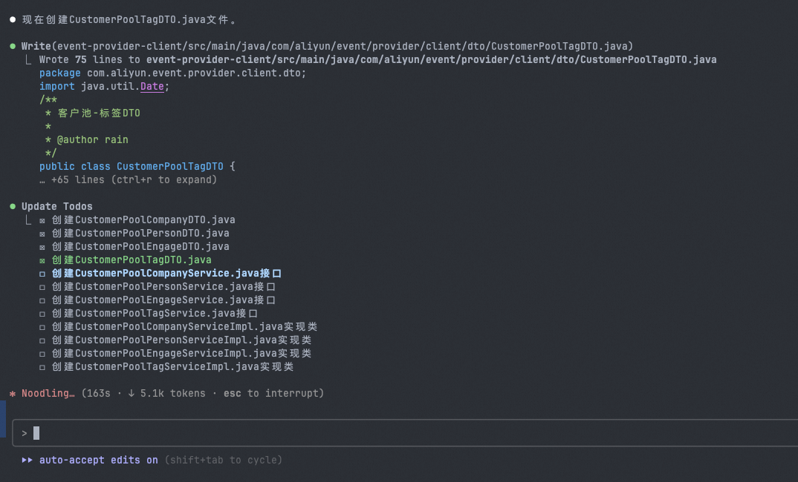
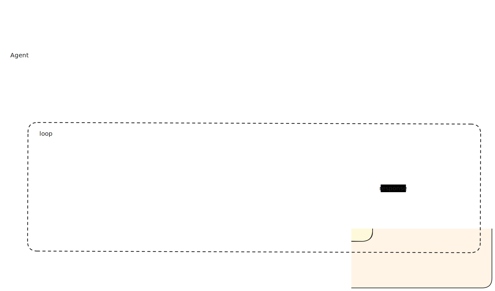

# Build A Good Agent **I.** From intuition to insight

# 导读

今年开始，**Agent** 已经被越来越多的人接触、在自己的业务里尝试落地。无论是自动化运营、数据分析，还是智能客服、语音助手等，大家或多或少都做出过属于自己场景的 Agent。

然而在实际的探索中，发现自己身上所出现的一个问题：对 Agent 的理解，往往是零散的、由感觉和碎片化的信息来驱动的。看到一个新框架或新技术就立刻上手，把它当作现成的“工具箱”；遇到一个环节觉得“这里好像能用 Agent代替”，就试一试；东一榔头，西一棒槌。这样的过程虽然充满探索的乐趣，但也很容易停留在 **“直觉”** 和“会用”的阶段——能用就用，却未必真正理解 Agent 的底层逻辑与架构思维。

所以在这篇文章以及后续的文章中，我想从直觉导向一步步走向真正的理解和掌握。不仅知其然，更知其所以然，对 Agent 的认知从零散的感性经验，进化为可迁移、可复用的系统性和工业实践。

（强调空口无凭，所以自己基于实践做了两个Agent和一个完全可运行的Agent各个模块的实践教程，放在文章最后，如果感兴趣不妨看看）

# Part1. 什么是Agent？

## Agent的定义

像学习物理一样，从一句话的定义开始认识Agent的概念，下面是三家公司对Agent 的定义：

（OpenAI）智能体是能够**自主代表用户完成任务**的系统。

（Google）AI 智能体是一种使用 AI 实现目标、代表用户完成任务的软件系统。

（Anthropic）**智能体**是由 LLM 自主动态指挥自身流程和工具使用的系统，对如何完成任务保持主导控制权。

| 定义类型  | OpenAI                                                                        | Google                             | Anthropic                                            |
| ----- | ----------------------------------------------------------------------------- | ---------------------------------- | ---------------------------------------------------- |
| 智能体定义 | 智能体是能够\*\*自主代表用户完成任务\*\*的系统。                                                  | AI 智能体是一种使用 AI 实现目标、代表用户完成任务的软件系统。 | \*\*智能体\*\*是由 LLM 自主动态指挥自身流程和工具使用的系统，对如何完成任务保持主导控制权。 |
| 工作流定义 | 工作流是一系列必须按顺序执行的步骤，旨在实现用户的目标。 目标包括\*\*解决客户服务问题、预订餐厅、提交代码变更\*\*，或\*\*生成报告\*\*等。 | —                                  | \*\*工作流\*\*是通过预定义的代码路径对大语言模型（LLM）和工具进行编排的系统。         |

不难看出，无论是哪一家都强调了智能体中的**自主和主导**性，自主决策也成为了区分Agent的基于LLM实现的重要标志。（从上面的表格中，提取出Agent的核心特性，并且通俗的解释）OpenAI和Anthropic特别地在对Agent定义之后，紧接着区分了智能体和工作流的概念。

## Agent vs Workflow

而对于工作流则强调了顺序和编排。光看概念有一些抽象，我们以“实现一次交易”为目标看看二者的不同：

（这里换成流程图来区分工作留模式和智能体模式）

| 模式                    | 描述                                                                                                               | 特点                                                                                                 |
| --------------------- | ---------------------------------------------------------------------------------------------------------------- | -------------------------------------------------------------------------------------------------- |
| **工作流模式（Workflow）** ​ | 系统按照固定的流程执行： 1\\. 用户输入出差日期和城市 2\\. 调用机票 API 查询并预订 3\\. 接着调用酒店 API 预订住宿4. 最后填充会议安排模板                              | \\- 每一步都有\*\*固定顺序\*\*和\*\*明确代码路径\*\*- 大语言模型的作用有限，仅用于自然语言解析或填充表单- 若某一步失败，系统可能会报错或需要用户干预             |
| **智能体模式（Agent）** ​    | 一个智能体接收用户“我要去上海出差”的意图后，自主调用搜索工具查航班，若发现当天无航班，会改查前一天的；在酒店预订环节，它会根据用户以往偏好自动筛选“靠地铁”“有早餐”的酒店；安排会议时，它会查阅用户日历，避开已有会议时段。 | \\- LLM 负责\*\*流程决策\*\*，并可\*\*动态调整执行路径\*\*- 具备\*\*记忆、偏好识别和异常处理\*\*能力- 整体流程\*\*更灵活、智能，用户只需提出目标即可\*\* |

（强调个人对于工作留和Agent的理解，从if...else的分支到自主的loop循环）在我看来Workflow是一串串的ifelse逻辑，当这个条件match上了就走到里面的链路，执行完了再拿着结果找下一个条件；而Agent是route和一串串的(plan-action-feedback)即意图识别，自主判断出用户的目标之后，将目标拆解为具体的todos依次执行，并且根据每次执行的结果来动态的调整自己的todos。（关于这个结论使用过Claude Code的同学应该更有感触）

（强调workflow和Agent两者都可以解决实际的问题，并且达到基本上同样的效果，所以什么时候选择Workflow什么时候选择Agent是应该更加深入讨论的问题）

### Workflow的局限

（强调Workflow适用哪些场景，不适用哪些场景。以及Workflow自身的特性，比如需要维护，扩展困难，虽然有Dify、n8n这样的工具，但是仍然具有缺陷，要求落地，能够衔接上面的场景做到通俗易懂，便于理解，同时具备一定的深度）

写过代码的朋友都知道，我们看到一堆堆的if 和else时就会：

对于工作流也是一样的，随着业务的迭代，工作流的理解成本和修改成本都会以非线性来增加。虽然工作流提供了非常友好的可视化编辑，但是也正是由于这样的编辑使其使用的用户更偏向缺少工程经验的人群。

### Agent的解决之道

（针对Workflow的不足之处，Agent的出现解决了其中的哪些问题，Agent是如何做到解决的，为什么有效）固定的分支走到了动态

ReAct

CoT

[   https://lilianweng.github.io/posts/2023-06-23-agent/](https://lilianweng.github.io/posts/2023-06-23-agent/ "   https://lilianweng.github.io/posts/2023-06-23-agent/")

Agent=xxx+xxx+xxx

但是随着发展，Agent仅靠这三个要素已经达不到我们的实际需求，下面就看看一个完整的Agent需要哪些能力？&#x20;

【在上面的内容中，我们定义了Agent是一个有自主能力实现用户目标的系统，而通过具体的例子也初步也初步得出了为实现自主的目的，Agent需要有意图识别，计划，行动和反馈的核心能力，从系统性的学习上，为了实现自主和行动，Agent需要有哪些能力？】

# Part2. Agent的能力

Agent既然作为一个代理，对于其能力和之前的Chatbot或者copilot相比有着更高的要求，关于Agent所具有的能力，我认为最完整和明确的是谷歌对其的定义：

> 在[ReAct Framework ](https://cloud.google.com/discover/what-are-ai-agents "ReAct Framework ")中定义 AI 智能体的能力**推理和执行**，但随着时间的推移，更多功能也随之发展起来。
>
> - **推理**：此核心认知过程涉及使用逻辑和可用信息来得出结论、进行推断及解决问题。具有强大推理能力的 AI 智能体可以分析数据、识别模式，并根据证据和上下文做出明智的决策。
> - **行动**：根据决策、计划或外部输入采取行动或执行任务的能力对于 AI 智能体与其环境进行互动和实现目标至关重要。这可能包括具身 AI 的物理动作，或发送消息、更新数据或触发其他流程等数字操作。
> - **观察**：通过感知或感应收集有关环境或情况的信息，对于 AI 智能体了解上下文并做出明智的决策至关重要。这可能涉及各种形式的感知，例如计算机视觉、自然语言处理或传感器数据分析。
> - **规划**：制定实现目标的战略计划是智能行为的关键方面。具有规划能力的 AI 智能体可以确定必要的步骤、评估潜在行动，并根据可用信息和预期结果选择最佳行动方案。这通常涉及预测未来状态和考虑潜在障碍。
> - **协作**：在复杂且动态的环境中，与他人（无论是人类还是其他 AI 智能体）有效协作来实现共同目标变得越来越重要。协作需要沟通、协调以及理解和尊重他人观点的能力。
> - **自我完善**：自我改进和自适应能力是高级 AI 系统的标志。具有自我完善能力的 AI 智能体可以从经验中学习，根据反馈调整行为，并随着时间的推移不断提升性能和能力。这可能涉及机器学习技术、优化算法或其他形式的自行修改。

虽然这些阅读、了解这些定义已经足够认清Agent的能力，但是还是以一个例子来从0到1的推理，在这个推理过程中，很轻易就可以得出和上面基本一致的结论：

（我们仍然使用做交易为例子，从操作流程上来去分析Agent该具备的能力）

我们来看下面这样一个场景：

## 2.1 监听&观察

做过交易的朋友都知道，在非机构的交易中有两个流派：基于事件交易和基于数据交易，或是为二者的结合。

基于事件去分析时，我们现在需要不仅要关注美联储和特朗普的X账号

而现在，在这个时候也紧张：

对于而对于这些信息的获取，我定义为智能体的监听能力，这些消息具有广播性和不确定性，智能体会用监听的方式捕获这些消息，从而立即采取行动；

基于数据交易时，我们需要观察K线数据、宏观数据等等，

观察的对象则更具固定和稳定性，比如NDX的走势，在整体趋势向上的时候才会采取做多或是入场。

监听和观察对比来看：

监听的消息是不确定的，可能听到各种各样的杂音，今天这个大师说什么了，明天那个大师说什么了，所以我们可以监听特定的对象（类似于订阅）。对于

观察的对象是确定的，除了我们观察定义好的对象之外，我们不会受到干扰。

对于监听和观察来说，如果听的准，过滤杂音，看的清。从技术实现的角度来说，这些都不难实现。设计模式中俄的订阅模式或者观察者模式

## 2.2 思考和计划

当我们获取了足够的信息之后，就准备采取对应的行动了。但是行动之前实际上，我们基于获取到的信息进行了处理和思考以及计划。比如我们通过新闻获取到了美联储即将降息5bp的信息，但是同时页看到市场对于降息的预期是10bp，我们观察到大盘最近整体的趋势在向上，但是又观察到了大额的空单。所以我们需要不断更新自己最后的目标和结论。这里我们强调了对信息的处理能力和动态的判断，我们不会沿着特定的方向去执行，但是却有一条明确的分析思路。

## 2.3 行动

在交易过程中，我们需要随时随刻的行动，这里的行动可不仅仅是最后的挂单止损或者买入。

涉及到行动的地方，

当我得出了一个具体的目标之后，我们就要采取对应的行动了，这一步并不难。只要清楚要是止损、挂单、还是要Buy In就可以轻松的完成。

## 2.4 记忆

在我们拿捏不准的时候……

记忆可以是经验和也可以是教训，从positive和nagetive两个方面影响我们的最终决策。成功

当我们在思考的过程中，我们会遇到一些卡壳的点，我们深知这个问题有些困难，

> OpenAI [https://openai.com/zh-Hans-CN/index/gpt-4-research/](https://openai.com/zh-Hans-CN/index/gpt-4-research/ "https://openai.com/zh-Hans-CN/index/gpt-4-research/")
>
> 我们利用来自对抗性测试项目以及 ChatGPT 的经验教训，投入 6 个月时间对 GPT‑4 进行迭代[对齐⁠](https://openai.com/zh-Hans-CN/index/instruction-following/ "对齐⁠")，使其在事实性、可控性以及拒绝打破规则等方面的表现达到了前所未有的水平（尽管与完美仍有很大差距）。

## 2.5 巩固和反思

当我们做完下单之后，根据最终的结果会知道我们这次的结论是否合理。

## 2.6 交流协作

# Part3. Agent的交互

（强调虽然没有做过产品经理，但是作为用户和开发的角色，认为开发一个产品最关键的是定义其和用户的交互方式。）

## LLM的交互演进

对话框ChatBot

副驾驶 Copilot：风靡一时

代理Agent：采纳or拒绝

## GUI or CLI？It's not A Problem

先抛出第一个问题，选择GUI 还是 CLI呢？换句话你会选择Cursor还是Claude Code呢？

我相信每一个进入阿里云的程序员或多或少都会遇到这样的一个场面：出了的机器紧急问题，当你还在SLS里面叭叭日志的时候，师兄们个个点开了机子，进入Linux控制台，一顿grep, tail, ps -ef……当你还满头大汗没找到事故地点时，师兄们已经定位了问题，重启了机器，并且喝了一口水。至今我虽然没有学会这些Linux的指令操作，但是学会了重启

其实这不是一个有唯一解的选项，在Agent的能力、价格相同的情况下，这两种其实都是很好的交互方式。

不论是**GUI 还是CLI，它们是承载“人机协作”的窗口**，显示了Agent 当前执行了哪一步、Agent 正在思考什么、Agent在调用哪个工具，调用的结果是什么？是实现可控性的关键，也是让Agent显得更加靠谱的

打断、继续、切换任务等场景

但是我觉得对于交易的Agent，CLI不是一个好的交互选择。CLI更适合实时需要操作输入的场景（比如文字类Agent，Code类Agent）（复杂度根据输入和交互的频率决定）

感知Agent执行内容

实时调整需求和目标

但是为什么要将这个问题抛出来呢？是因为在实践的过程中，定义好了交互=定义好了Agent的产品形态。我们先走出Agent这个范围，看看经典的交互模式：

### 交互的

新增

打断

继续

有时候GUI的交互决定了Agent的能力。在实践的过程中，想明白了某一个技术板块（如Contxext、Prompt等）并不能帮助自己想明白这个产品的设计；但是想明白了如何交互，基本清楚了后置的全部链路。

这个Part不再是技术领域的问题，而更是一个产品设计和UI交互的问题，但是同时也是能不能做好一个Agent产品的关键。

这一部分是自己在实践中认为至关重要的一点

## 控制你的Agent

### A Suit or JAVIS？

假设我们，

从ChaptGPT、Cursor、Cloud Code观察LLM的交互演化。在写这篇文章的时候，距离Claude Code发布已经过了两个多月，距Cursor的爆发式增长已经过去了10个月。而值得注意的是，在最新的Claude Code中，仍然采取了Suit式的设计理念，但是Claude Code把Cursor中的拖拽去掉了，而是

不论是Cursor还是Claude Code，它们都具有的是

黑盒强大并且可扩展、自定义的System Prompt

更高效更直觉的Build Context

使用“/”来承接指令集合

在Karpathy的xxx演讲中 提到

战衣是增强工具：托尼·斯塔克穿上战衣，能力大增，但人还在掌控。

战衣也能自主：在电影里，战衣能自己飞去找托尼，类似AI代理。

现在更适合做战衣：现阶段，LLM还不可靠，适合做增强工具（部分自主产品），而不是完全自主的“机器人”。

在

流程是否可随时打断？被打断后是否可继续？

Prompt有问题是否支持随时的调整？

### 阶梯式的权限设计

交互决定了使用LLM的尺度和能力范围。

这个Part我们将拆成两个部分，人和Agent或者LLM的交互范式是什么？GUI。

# 挖坑内容

关于Agent的实现优化，在下一篇文章中我们将要讨论的有Single-Agent的实现与优化，Agent的测评。

在这一个Part中，我们将思考xxx、xxx、xxx几个大问题，回答并实现xxx、xxx、xxx、xxx。结合Gemini CLI、Claude Code（逆向，由ShareAI提供）

如何让Agent更聪明呢？思考这个问题的时候我们不妨换个角度，为什么班里的学霸比自己的成绩高，或者为了提高自己的成绩，自己曾经做过最有效的事情是什么？

更聪明的脑子，你是否遇到过自己死活理解不了的问题，别人用三言两语讲的一清二楚。智商的差距是人与人之间难以逾越的鸿沟，对于大模型也是一样，让一个7B的模型和72B的模型碰一碰，就算是把7B的模型做到极致，我相信从复杂问题的解决和理解能力上，二者也如同小学生无法和大学生区抗衡。（但是不乏有特定领域的超级强的小模型）

但是更聪明的脑子不等于更强大的能力，特别是对于大模型来说，由于越强大的模型背后所训练的数据越多，造成了不同程度的泛化。所以如何激活这个大脑的特定区域，已实现我们的目标呢？（就像是考数学时激活数学区域，而不是语文、物理）

更强大的记忆，过目不忘的能力不论什么时候往往和天才放到一起，“这个题之前老师在几号几号讲过”。

但是更强大的记忆不等于更正确的思考

保存机制-召回机制-反馈机制（强化学习）

还有学霸们通常有这更好的习惯，并且生活、作息规律，且极度自律。成为学渣的理由千奇百怪，成为学霸的理由始终如一，仅仅通过一个学生的行为处事就可以判断成绩的差不到哪里去。

# 参考资料&推荐阅读

[   https://cloud.google.com/discover/what-are-ai-agents?hl=zh\_cn#what-is-the-difference-between-ai-agents-ai-assistants-and-bots](https://cloud.google.com/discover/what-are-ai-agents?hl=zh_cn#what-is-the-difference-between-ai-agents-ai-assistants-and-bots "   https://cloud.google.com/discover/what-are-ai-agents?hl=zh_cn#what-is-the-difference-between-ai-agents-ai-assistants-and-bots")

[   https://cdn.openai.com/business-guides-and-resources/a-practical-guide-to-building-agents.pdf](https://cdn.openai.com/business-guides-and-resources/a-practical-guide-to-building-agents.pdf "   https://cdn.openai.com/business-guides-and-resources/a-practical-guide-to-building-agents.pdf")

[   https://openai.com/zh-Hans-CN/index/gpt-4-research/](https://openai.com/zh-Hans-CN/index/gpt-4-research/ "   https://openai.com/zh-Hans-CN/index/gpt-4-research/")

[ Building Effective AI Agents \ Anthropic Discover how Anthropic approaches the development of reliable AI agents. Learn about our research on agent capabilities, safety considerations, and technical framework for building trustworthy AI. https://www.anthropic.com/engineering/building-effective-agents](https://www.anthropic.com/engineering/building-effective-agents " Building Effective AI Agents \ Anthropic Discover how Anthropic approaches the development of reliable AI agents. Learn about our research on agent capabilities, safety considerations, and technical framework for building trustworthy AI. https://www.anthropic.com/engineering/building-effective-agents")

[   https://www.youtube.com/watch?v=LCEmiRjPEtQ](https://www.youtube.com/watch?v=LCEmiRjPEtQ "   https://www.youtube.com/watch?v=LCEmiRjPEtQ")
